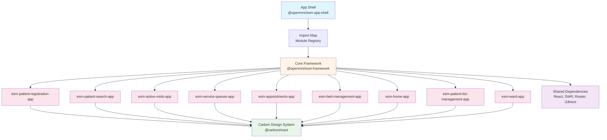
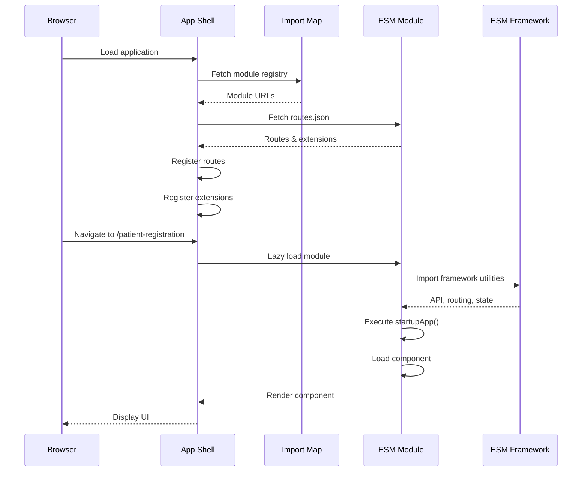
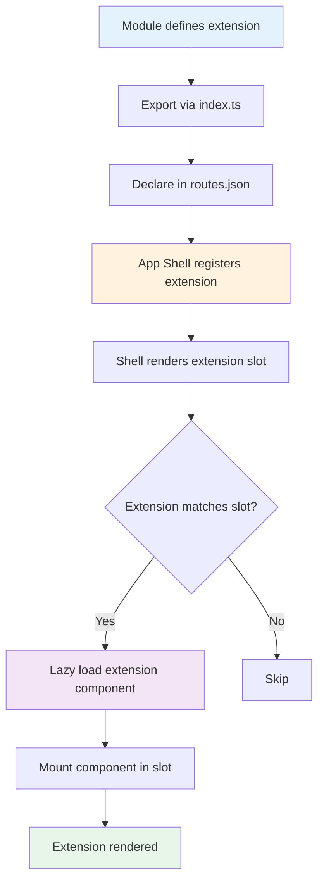
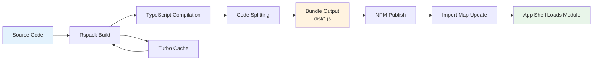

# System Architecture Survey

**Updated Date:** 2026-04-17  
**Analyzed By:** TrangN

---

## Table of Contents

1. [Overview](#overview)
2. [Related Files](#related-files)
3. [Core Tech Stack](#core-tech-stack)
4. [Monorepo Structure](#monorepo-structure)
5. [Module Dependencies](#module-dependencies)
6. [Entry Points & Loading Mechanism](#entry-points--loading-mechanism)
7. [Diagrams](#diagrams)
8. [Key Insights](#key-insights)
9. [Questions & Todos](#questions--todos)

---

## Overview

This document provides a comprehensive architectural survey of the OpenMRS Patient Management monorepo, which is part of the OpenMRS 3.x (O3) frontend ecosystem. The system follows a **micro-frontend architecture** using the ESM (ES Module) pattern, where independent modules are dynamically loaded into a shell application at runtime.

### Purpose
- Document the monorepo structure and build system
- Identify core technologies and their versions
- Map module dependencies and relationships
- Understand the micro-frontend loading mechanism
- Provide architectural context for mobile app development

### Scope
This survey covers:
- Monorepo organization and tooling
- Core technology stack
- ESM module structure and dependencies
- Extension system and routing
- Build and deployment pipeline

---

## Related Files

### OpenMRS Source Files Analyzed

**Root Configuration:**
- `package.json` - Root monorepo configuration with workspaces
- `turbo.json` - Turborepo task orchestration configuration
- `README.md` - Project documentation and setup guide
- `yarn.lock` - Dependency lock file (Yarn 4.10.3)

**ESM Module Packages:**
- `packages/esm-patient-registration-app/package.json` - Patient registration module
- `packages/esm-patient-search-app/package.json` - Patient search module
- `packages/esm-active-visits-app/package.json` - Active visits widget
- `packages/esm-service-queues-app/package.json` - Service queues module

**Module Configuration:**
- `packages/esm-patient-registration-app/src/index.ts` - Module entry point and exports
- `packages/esm-patient-registration-app/src/routes.json` - Route and extension definitions
- `packages/esm-patient-registration-app/rspack.config.js` - Build configuration

**Build System:**
- `packages/esm-patient-registration-app/rspack.config.js` - Rspack bundler config

---

## Core Tech Stack

### Frontend Framework
| Technology | Version | Purpose |
|------------|---------|---------|
| **React** | `18.3.1` | UI framework |
| **React DOM** | `18.3.1` | React rendering |
| **React Router DOM** | `6.3.0` | Client-side routing |
| **TypeScript** | `5.0.0` | Type-safe JavaScript |

### State Management & Data Fetching
| Technology | Version | Purpose |
|------------|---------|---------|
| **SWR** | `2.2.5` | Data fetching and caching |
| **Formik** | `2.1.5` | Form state management (patient registration) |
| **React Hook Form** | `7.54.0` | Form state management (search, queues) |

### UI Component Library
| Technology | Version | Purpose |
|------------|---------|---------|
| **Carbon Design System** | `1.83.0` | IBM Carbon React components |
| **@carbon/react** | `1.83.0` | Carbon React implementation |

### Validation & Schema
| Technology | Version | Purpose |
|------------|---------|---------|
| **Yup** | `0.29.1` | Schema validation (patient registration) |
| **Zod** | `3.24.1` | Schema validation (service queues) |

### Internationalization
| Technology | Version | Purpose |
|------------|---------|---------|
| **i18next** | `25.0.0` | Internationalization framework |
| **react-i18next** | `16.0.0` | React bindings for i18next |

### Build Tools
| Technology | Version | Purpose |
|------------|---------|---------|
| **Rspack** | Latest | Fast Rust-based bundler (Webpack alternative) |
| **Turbo** | `2.5.2` | Monorepo task orchestration |
| **SWC** | `1.2.165` | Fast TypeScript/JavaScript compiler |
| **Babel** | `7.11.6` | JavaScript transpiler (legacy support) |

### Testing
| Technology | Version | Purpose |
|------------|---------|---------|
| **Jest** | `29.7.0` | Unit testing framework |
| **@testing-library/react** | `14.1.2` | React component testing |
| **Playwright** | `1.53.2` | End-to-end testing |

### Package Management
| Technology | Version | Purpose |
|------------|---------|---------|
| **Yarn** | `4.10.3` | Package manager (Berry/v4) |
| **Yarn Workspaces** | Built-in | Monorepo workspace management |

### OpenMRS Framework
| Technology | Version | Purpose |
|------------|---------|---------|
| **@openmrs/esm-framework** | `9.x` (next) | Core OpenMRS frontend framework |
| **@openmrs/esm-app-shell** | `9.0.3-pre.4519` | Application shell for loading ESMs |
| **openmrs** (CLI) | `next` | Development tooling |

### Utilities
| Technology | Version | Purpose |
|------------|---------|---------|
| **lodash-es** | `4.17.15` | Utility functions (ES modules) |
| **dayjs** | `1.8.36` | Date manipulation |
| **uuid** | `8.3.2` | UUID generation |
| **classnames** | `2.3.2` | Conditional CSS class names |

---

## Monorepo Structure

### Organization Pattern: Yarn Workspaces + Turborepo

The project uses **Yarn Workspaces** for dependency management and **Turborepo** for build orchestration.

#### Workspace Configuration
```json
{
  "workspaces": [
    "packages/*"
  ]
}
```

All ESM modules are located in the `packages/` directory, with each module being an independent npm package.

### Monorepo Architecture

```
openmrs-esm-patient-management/
├── package.json                    # Root workspace configuration
├── turbo.json                      # Turborepo task pipeline
├── yarn.lock                       # Dependency lock file
├── .yarn/                          # Yarn 4 (Berry) installation
│
├── packages/                       # ESM Modules (Workspaces)
│   ├── esm-patient-registration-app/
│   ├── esm-patient-search-app/
│   ├── esm-active-visits-app/
│   ├── esm-appointments-app/
│   ├── esm-bed-management-app/
│   ├── esm-home-app/
│   ├── esm-patient-list-management-app/
│   ├── esm-service-queues-app/
│   └── esm-ward-app/
│
├── e2e/                           # End-to-end tests
├── tools/                         # Build tools and configs
└── __mocks__/                     # Shared test mocks
```

### ESM Module Structure (Standard Pattern)

Each ESM module follows a consistent structure:

```
esm-{module-name}-app/
├── package.json                   # Module package definition
├── rspack.config.js              # Build configuration
├── tsconfig.json                 # TypeScript configuration
├── jest.config.js                # Test configuration
│
├── src/
│   ├── index.ts                  # Module entry point (exports)
│   ├── routes.json               # Route and extension definitions
│   ├── config-schema.ts          # Configuration schema
│   ├── root.component.tsx        # Root React component
│   └── [feature-folders]/        # Feature-specific code
│
└── translations/                  # i18n translation files
    ├── en.json
    ├── fr.json
    └── [other-locales].json
```

### Turborepo Task Pipeline

Turborepo orchestrates tasks across all workspaces with dependency awareness:

```json
{
  "tasks": {
    "build": {
      "outputs": ["dist/**"]
    },
    "lint": {
      "dependsOn": ["^lint"]
    },
    "typescript": {
      "dependsOn": ["^typescript"]
    },
    "test": {
      "dependsOn": ["^test"]
    }
  }
}
```

**Key Features:**
- **Parallel Execution**: Runs tasks in parallel where possible
- **Dependency Awareness**: Respects task dependencies (`^` prefix)
- **Caching**: Caches task outputs for faster rebuilds
- **Incremental Builds**: Only rebuilds changed packages

---

## Module Dependencies

### Dependency Categories

#### 1. Core Framework (Peer Dependencies)
All ESM modules depend on these core libraries as **peer dependencies**:

```json
{
  "@openmrs/esm-framework": "9.x",
  "react": "18.x",
  "react-i18next": "16.x",
  "react-router-dom": "6.x",
  "swr": "2.x"
}
```

**Rationale**: Peer dependencies ensure a single shared instance across all modules, preventing duplication and version conflicts.

#### 2. UI Components (Direct Dependencies)
```json
{
  "@carbon/react": "^1.83.0",
  "classnames": "^2.3.2"
}
```

#### 3. Module-Specific Dependencies

**Patient Registration:**
- `formik`: Form state management
- `yup`: Validation schema
- `uuid`: Identifier generation

**Patient Search:**
- `react-hook-form`: Form handling
- `lodash-es`: Utility functions

**Service Queues:**
- `react-hook-form`: Form handling
- `@hookform/resolvers`: Form validation resolvers
- `zod`: Schema validation

**Active Visits:**
- `dayjs`: Date manipulation
- `lodash-es`: Utility functions

### Module Relationship Map

```
Core Framework (@openmrs/esm-framework)
├── Provides: API client, routing, state, extensions
├── Used by: ALL ESM modules
│
ESM Modules (Independent)
├── esm-patient-registration-app
│   ├── Exports: Patient registration forms
│   └── Extensions: Add patient button, edit patient button
│
├── esm-patient-search-app
│   ├── Exports: Patient search interface
│   └── Extensions: Search bar, search results
│
├── esm-active-visits-app
│   ├── Exports: Active visits widget
│   └── Extensions: Visit list, visit actions
│
├── esm-service-queues-app
│   ├── Exports: Queue management
│   └── Extensions: Queue dashboard, queue actions
│
└── [Other ESM modules...]
```

### Dependency Flow

```
App Shell (@openmrs/esm-app-shell)
    ↓
Import Map (Dynamic)
    ↓
ESM Modules (Lazy Loaded)
    ↓
@openmrs/esm-framework (Shared)
    ↓
React, SWR, Router (Shared Peer Dependencies)
```

---

## Entry Points & Loading Mechanism

### 1. Module Entry Point (`index.ts`)

Each ESM module exports its components and lifecycle functions:

```typescript
// packages/esm-patient-registration-app/src/index.ts

import { defineConfigSchema, getAsyncLifecycle, getSyncLifecycle } from '@openmrs/esm-framework';

// Module initialization
export function startupApp() {
  defineConfigSchema(moduleName, esmPatientRegistrationSchema);
  setupOffline();
}

// Page components (lazy loaded)
export const root = getAsyncLifecycle(() => import('./root.component'), options);
export const editPatient = getAsyncLifecycle(() => import('./root.component'), options);

// Extension components
export const addPatientLink = getSyncLifecycle(addPatientLinkComponent, options);
export const patientPhotoExtension = getAsyncLifecycle(() => import('./patient-photo.extension'), options);

// Modal components
export const cancelPatientEditModal = getAsyncLifecycle(() => import('./widgets/cancel-patient-edit.modal'), options);

// Translations
export const importTranslation = require.context('../translations', false, /.json$/, 'lazy');
```

**Key Concepts:**
- **`getAsyncLifecycle`**: Lazy loads components (code splitting)
- **`getSyncLifecycle`**: Loads components immediately
- **`startupApp`**: Module initialization function
- **`importTranslation`**: Dynamic translation loading

### 2. Routes Configuration (`routes.json`)

Each module defines its routes and extensions:

```json
{
  "$schema": "https://json.openmrs.org/routes.schema.json",
  "backendDependencies": {
    "webservices.rest": ">=2.2.0"
  },
  "pages": [
    {
      "component": "root",
      "route": "patient-registration",
      "online": true,
      "offline": true
    }
  ],
  "extensions": [
    {
      "component": "addPatientLink",
      "name": "add-patient-action",
      "slot": "top-nav-actions-slot",
      "online": true,
      "offline": true,
      "order": 30
    }
  ],
  "modals": [
    {
      "name": "cancel-patient-edit-modal",
      "component": "cancelPatientEditModal"
    }
  ]
}
```

**Key Concepts:**
- **Pages**: Route-based components
- **Extensions**: Components that plug into extension slots
- **Modals**: Named modal components
- **Slots**: Extension points where components can be mounted
- **Order**: Controls extension rendering order

### 3. App Shell Loading Process

The OpenMRS App Shell (`@openmrs/esm-app-shell`) orchestrates module loading:

```
1. App Shell Initialization
   ↓
2. Load Import Map (Module Registry)
   ↓
3. Fetch routes.json from each module
   ↓
4. Register routes and extensions
   ↓
5. Render shell with extension slots
   ↓
6. Lazy load modules on route match
   ↓
7. Mount components in extension slots
```

### 4. Extension System

The extension system allows modules to contribute UI to predefined slots:

**Common Extension Slots:**
- `top-nav-actions-slot`: Top navigation actions
- `patient-actions-slot`: Patient-specific actions
- `patient-photo-slot`: Patient photo display
- `patient-search-actions-slot`: Search result actions

**Extension Registration Flow:**
```typescript
// Module exports extension
export const addPatientLink = getSyncLifecycle(addPatientLinkComponent, options);

// routes.json declares extension
{
  "component": "addPatientLink",
  "name": "add-patient-action",
  "slot": "top-nav-actions-slot"
}

// App shell renders slot
<ExtensionSlot name="top-nav-actions-slot" />

// Extension component is mounted
<AddPatientLink />
```

### 5. Build Output

Each module builds to a single JavaScript bundle:

```
dist/
└── openmrs-esm-{module-name}-app.js
```

**Build Configuration:**
- **Bundler**: Rspack (Webpack alternative)
- **Format**: ES Modules (ESM)
- **Target**: Modern browsers
- **Code Splitting**: Automatic via dynamic imports

### 6. Development Mode

Development uses the `openmrs` CLI:

```bash
# Start dev server with specific modules
yarn start --sources 'packages/esm-patient-registration-app'

# Start with multiple modules
yarn start --sources 'packages/esm-patient-search-app' \
           --sources 'packages/esm-patient-registration-app'
```

**Dev Server Features:**
- Hot Module Replacement (HMR)
- Live reloading
- Source maps
- Module federation

---

## Diagrams

### Monorepo Architecture



### Module Loading Sequence



### Extension System Flow



### Build & Deployment Pipeline



---

## Key Insights

### 💡 Business Insights

- **Micro-Frontend Architecture**: The system uses a true micro-frontend pattern where each module is independently developed, built, and deployed. This enables:
  - **Team Autonomy**: Different teams can work on different modules without conflicts
  - **Independent Releases**: Modules can be released independently without rebuilding the entire application
  - **Technology Flexibility**: Each module can use different libraries (e.g., Formik vs React Hook Form)

- **Extension System**: The extension/slot pattern is a powerful architectural feature that allows:
  - **Composability**: Modules can contribute UI to any part of the application
  - **Customization**: Implementations can enable/disable extensions via configuration
  - **Extensibility**: New modules can extend existing functionality without modifying core code

- **Offline-First Design**: All modules declare `"online": true, "offline": true`, indicating:
  - **Progressive Web App (PWA)** capabilities
  - **Service Worker** integration for offline functionality
  - **Local data caching** and synchronization strategies

- **Internationalization (i18n)**: Comprehensive i18n support with 40+ locales:
  - **Global Reach**: System is designed for international deployment
  - **Translation Management**: Centralized translation extraction and management
  - **Lazy Loading**: Translations are loaded on-demand to reduce initial bundle size

- **Configuration-Driven**: Each module has a configuration schema:
  - **Customizable Behavior**: Implementations can customize module behavior without code changes
  - **Feature Flags**: Enable/disable features via configuration
  - **Environment-Specific Settings**: Different configs for dev, staging, production

### ⚠️ Risks & Warnings

- **Complex Build System**: The build system involves multiple layers:
  - **Rspack** (bundler) + **Turbo** (orchestrator) + **SWC** (compiler) + **Yarn Workspaces**
  - **Risk**: Steep learning curve for new developers
  - **Risk**: Build failures can be difficult to debug
  - **Mitigation**: Comprehensive documentation and standardized configs

- **Dependency Management Complexity**:
  - **Peer Dependencies**: All modules must use compatible versions of React, SWR, etc.
  - **Risk**: Version mismatches can cause runtime errors
  - **Risk**: Upgrading core dependencies requires coordinating across all modules
  - **Mitigation**: Automated dependency checks and version constraints

- **Module Federation Overhead**:
  - **Runtime Loading**: Modules are loaded dynamically at runtime
  - **Risk**: Network latency affects initial load time
  - **Risk**: Module loading failures can break functionality
  - **Mitigation**: Proper error boundaries and fallback UI

- **Framework Lock-In**:
  - **Tight Coupling**: Modules are tightly coupled to `@openmrs/esm-framework`
  - **Risk**: Difficult to migrate away from OpenMRS framework
  - **Risk**: Framework bugs affect all modules
  - **Mitigation**: Framework is well-maintained and actively developed

- **Testing Complexity**:
  - **Integration Testing**: Testing module interactions is complex
  - **E2E Testing**: Requires full app shell and backend
  - **Risk**: Tests can be flaky due to async loading
  - **Mitigation**: Comprehensive test utilities and mocks

- **Monorepo Scaling**:
  - **Build Time**: As modules grow, build times increase
  - **Risk**: CI/CD pipelines can become slow
  - **Mitigation**: Turbo caching and incremental builds

### 🔗 Connections & Integration Points

#### For Mobile App Development

**1. API Integration Points**
- **REST API**: All modules use `@openmrs/esm-framework` for API calls
  - **Base URL**: `/ws/rest/v1/`
  - **Authentication**: Session-based (cookies)
  - **Mobile Consideration**: Mobile app will need to handle session management differently (tokens?)

**2. Data Fetching Patterns**
- **SWR**: All modules use SWR for data fetching and caching
  - **Mobile Consideration**: SWR patterns can be replicated in mobile (React Query, TanStack Query)
  - **Caching Strategy**: Understand SWR cache keys and revalidation logic

**3. State Management**
- **Framework State**: `@openmrs/esm-framework` provides global state
  - **Mobile Consideration**: Mobile app needs equivalent state management (Redux, Zustand, Context)
  - **Shared State**: Patient context, user session, location context

**4. Offline Capabilities**
- **Service Workers**: Web app uses service workers for offline
  - **Mobile Consideration**: Mobile app needs native offline storage (SQLite, Realm, AsyncStorage)
  - **Sync Strategy**: Understand web app's sync logic for consistency

**5. Extension System**
- **Slot-Based UI**: Web app uses extension slots for composability
  - **Mobile Consideration**: Mobile app could use similar pattern (React Native slots, navigation)
  - **Modularity**: Keep mobile app modular for future extensibility

**6. Configuration System**
- **Config Schema**: Each module has a configuration schema
  - **Mobile Consideration**: Mobile app needs configuration management (remote config, feature flags)
  - **Consistency**: Align mobile config with web config where possible

**7. Internationalization**
- **i18next**: Web app uses i18next for translations
  - **Mobile Consideration**: Use same i18next library in React Native
  - **Translation Files**: Reuse existing translation files from web app

**8. Form Validation**
- **Yup/Zod**: Web app uses schema validation
  - **Mobile Consideration**: Use same validation libraries in mobile
  - **Validation Rules**: Extract and reuse validation schemas

**9. UI Components**
- **Carbon Design**: Web app uses IBM Carbon
  - **Mobile Consideration**: Mobile needs equivalent component library (React Native Paper, NativeBase)
  - **Design Consistency**: Maintain visual consistency with web app

**10. Backend Dependencies**
- **OpenMRS REST API**: All modules depend on OpenMRS backend
  - **Mobile Consideration**: Mobile app will use same REST API
  - **Version Compatibility**: Ensure mobile app is compatible with backend version

---

## Questions & Todos

### ❓ Questions for Review

1. **Import Map Management**: How is the import map generated and updated in production? Is it static or dynamic?

2. **Module Versioning**: How are module version conflicts resolved when multiple modules depend on different versions of the same library?

3. **Extension Ordering**: How is the `order` property in extensions used? Is it relative or absolute?

4. **Offline Sync**: What is the offline synchronization strategy? How are conflicts resolved?

5. **Configuration Management**: How are module configurations managed across environments (dev, staging, production)?

6. **Performance Monitoring**: Are there performance metrics for module loading times? What is the acceptable threshold?

7. **Error Handling**: How are module loading errors handled? Is there a fallback mechanism?

8. **Security**: How is authentication handled in the micro-frontend architecture? Are there security concerns with dynamic module loading?

9. **Mobile API Compatibility**: Are there any API endpoints that are web-specific and won't work for mobile?

10. **Backend Version**: What is the minimum required OpenMRS backend version? Are there breaking changes between versions?

### ✅ Todo Items

- [ ] Document the import map generation process
- [ ] Create a module dependency graph visualization
- [ ] Document the offline synchronization strategy
- [ ] Map all extension slots used across modules
- [ ] Document the configuration schema for each module
- [ ] Create a guide for adding new ESM modules
- [ ] Document the deployment pipeline
- [ ] Create a troubleshooting guide for common build issues
- [ ] Document the testing strategy for micro-frontends
- [ ] Create a mobile app integration guide

### 🔍 Further Investigation Needed

- **App Shell Source Code**: Analyze `@openmrs/esm-app-shell` source code to understand module loading mechanism in detail
- **Framework Utilities**: Document all utilities provided by `@openmrs/esm-framework` that mobile app might need
- **Extension Slot Registry**: Create a comprehensive list of all available extension slots
- **API Endpoint Catalog**: Document all REST API endpoints used by modules
- **Offline Storage**: Investigate how offline data is stored and synchronized
- **Performance Benchmarks**: Measure module loading times and bundle sizes
- **Security Model**: Document authentication and authorization mechanisms
- **Configuration Schema**: Extract and document all configuration options
- **Translation Coverage**: Analyze translation completeness across locales
- **Mobile-Specific Requirements**: Identify features that need special handling in mobile app

---

**Last Updated:** 2026-04-17  
**Next Review:** 2026-04-24
