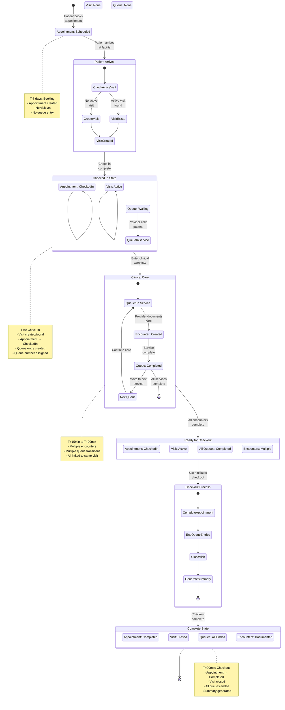
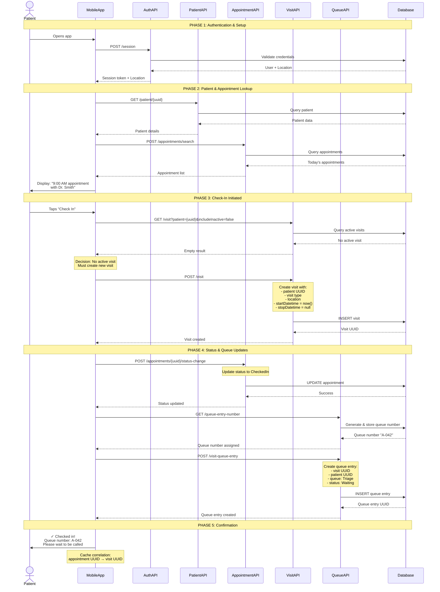

# Integrated Workflow Map

**Document Purpose:** End-to-end patient journey showing how entities interact  
**Last Updated:** 2026-04-17  
**Maintained By:** Business Analysis & Technical Documentation Team

---

## Overview

This document maps the complete patient journey through the OpenMRS system, showing exactly how Appointments, Visits, Encounters, and Queue Entries interact throughout a care episode. Unlike the individual entity analyses, this document focuses on the **integration points** and **implicit correlations** that mobile developers must implement.

**Critical Insight:** The OpenMRS system uses **implicit relationships** between entities rather than direct foreign keys. This workflow map provides the algorithms and state synchronization rules needed to maintain data consistency across entities.

---

## Table of Contents

1. [The Patient Journey Timeline](#the-patient-journey-timeline)
2. [Implicit Correlation Algorithm](#implicit-correlation-algorithm)
3. [State Synchronization Matrix](#state-synchronization-matrix)
4. [API Orchestration: The Golden Path](#api-orchestration-the-golden-path)
5. [Diagrams](#diagrams)
6. [Error Scenarios & Recovery](#error-scenarios--recovery)
7. [Mobile Implementation Checklist](#mobile-implementation-checklist)

---

## The Patient Journey Timeline

### Complete Care Episode Flow

This timeline shows **when** each entity is created or modified during a typical patient journey.

```
┌─────────────────────────────────────────────────────────────────────────────┐
│                        PATIENT JOURNEY TIMELINE                              │
└─────────────────────────────────────────────────────────────────────────────┘

TIME: T-7 days                    [BOOKING PHASE]
━━━━━━━━━━━━━━━━━━━━━━━━━━━━━━━━━━━━━━━━━━━━━━━━━━━━━━━━━━━━━━━━━━━━━━━━━━━━
Entity Created: APPOINTMENT
  └─ status: Scheduled
  └─ patient: {uuid}
  └─ service: HIV Clinic
  └─ startDateTime: T+0 09:00
  └─ provider: Dr. Smith

Action: Patient books appointment via mobile app or call center
Result: Appointment record created, confirmation sent


TIME: T+0 08:55                   [ARRIVAL PHASE]
━━━━━━━━━━━━━━━━━━━━━━━━━━━━━━━━━━━━━━━━━━━━━━━━━━━━━━━━━━━━━━━━━━━━━━━━━━━━
Action: Patient arrives at facility, opens mobile app

Mobile App Checks:
  1. GET /visit?patient={uuid}&includeInactive=false
     └─ Result: No active visit found
  
  2. Display: "Check in for your 9:00 AM appointment?"


TIME: T+0 09:00                   [CHECK-IN PHASE]
━━━━━━━━━━━━━━━━━━━━━━━━━━━━━━━━━━━━━━━━━━━━━━━━━━━━━━━━━━━━━━━━━━━━━━━━━━━━
Action: Patient taps "Check In" button

Step 1: CREATE VISIT
  POST /visit
  └─ patient: {uuid}
  └─ visitType: Facility Visit
  └─ location: HIV Clinic
  └─ startDatetime: 2026-04-17T09:00:00+03:00
  └─ stopDatetime: null  ← ACTIVE VISIT
  
  Result: Visit created with UUID: visit-abc-123

Step 2: UPDATE APPOINTMENT STATUS
  POST /appointments/{appointmentUuid}/status-change
  └─ toStatus: CheckedIn
  └─ onDate: 2026-04-17T09:00:00+03:00
  └─ timeZone: Africa/Nairobi
  
  Result: Appointment.status = CheckedIn

Step 3: GENERATE QUEUE NUMBER
  GET /queue-entry-number?location={loc}&queue={q}&visit={visit-abc-123}
  
  Result: Queue number "A-042" assigned as visit attribute

Step 4: CREATE QUEUE ENTRY
  POST /visit-queue-entry
  └─ visit: {uuid: visit-abc-123}
  └─ queueEntry:
      └─ patient: {uuid}
      └─ queue: Triage Queue
      └─ status: Waiting
      └─ priority: Normal
      └─ startedAt: 2026-04-17T09:00:00+03:00
      └─ sortWeight: 0
  
  Result: Patient in queue, number displayed on screen


TIME: T+0 09:15                   [TRIAGE PHASE]
━━━━━━━━━━━━━━━━━━━━━━━━━━━━━━━━━━━━━━━━━━━━━━━━━━━━━━━━━━━━━━━━━━━━━━━━━━━━
Action: Nurse calls patient from queue

Step 1: UPDATE QUEUE STATUS
  POST /queue-entry/{queueEntryUuid}
  └─ status: In Service
  
Step 2: CREATE TRIAGE ENCOUNTER
  POST /encounter
  └─ patient: {uuid}
  └─ visit: visit-abc-123  ← Links to visit
  └─ encounterType: Triage
  └─ location: HIV Clinic
  └─ encounterDatetime: 2026-04-17T09:15:00+03:00
  └─ encounterProviders: [Nurse Jane]
  └─ obs: [
      {concept: Weight, value: 68.5},
      {concept: Blood Pressure, value: "120/80"},
      {concept: Temperature, value: 36.8}
    ]
  
  Result: Triage encounter created, vitals recorded

Step 3: COMPLETE QUEUE ENTRY
  POST /queue-entry/{queueEntryUuid}
  └─ status: Completed
  └─ endedAt: 2026-04-17T09:25:00+03:00


TIME: T+0 09:30                   [CONSULTATION PHASE]
━━━━━━━━━━━━━━━━━━━━━━━━━━━━━━━━━━━━━━━━━━━━━━━━━━━━━━━━━━━━━━━━━━━━━━━━━━━━
Action: Patient moves to doctor consultation queue

Step 1: CREATE NEW QUEUE ENTRY
  POST /visit-queue-entry
  └─ visit: {uuid: visit-abc-123}  ← Same visit!
  └─ queueEntry:
      └─ queue: Doctor Consultation
      └─ status: Waiting
      └─ previousQueueEntry: {triage-queue-uuid}
  
Step 2: DOCTOR CALLS PATIENT
  Update queue status: In Service

Step 3: CREATE CONSULTATION ENCOUNTER
  POST /encounter
  └─ patient: {uuid}
  └─ visit: visit-abc-123  ← Same visit!
  └─ encounterType: Consultation
  └─ encounterDatetime: 2026-04-17T09:35:00+03:00
  └─ encounterProviders: [Dr. Smith]
  └─ obs: [
      {concept: Chief Complaint, value: "Follow-up visit"},
      {concept: Diagnosis, value: "HIV - stable on ART"}
    ]
  └─ orders: [
      {orderType: Drug Order, drug: "TDF/3TC/EFV", duration: 30 days}
    ]
  
  Result: Consultation documented, prescription created


TIME: T+0 10:00                   [PHARMACY PHASE]
━━━━━━━━━━━━━━━━━━━━━━━━━━━━━━━━━━━━━━━━━━━━━━━━━━━━━━━━━━━━━━━━━━━━━━━━━━━━
Action: Patient moves to pharmacy queue

Step 1: CREATE PHARMACY QUEUE ENTRY
  POST /visit-queue-entry
  └─ visit: {uuid: visit-abc-123}  ← Still same visit!
  └─ queueEntry:
      └─ queue: Pharmacy
      └─ status: Waiting

Step 2: PHARMACIST DISPENSES MEDICATION
  POST /encounter
  └─ encounterType: Medication Dispensing
  └─ visit: visit-abc-123
  └─ obs: [
      {concept: Medication Dispensed, value: "TDF/3TC/EFV 30 tablets"}
    ]


TIME: T+0 10:30                   [CHECK-OUT PHASE]
━━━━━━━━━━━━━━━━━━━━━━━━━━━━━━━━━━━━━━━━━━━━━━━━━━━━━━━━━━━━━━━━━━━━━━━━━━━━
Action: Patient completes all services, ready to leave

Step 1: COMPLETE APPOINTMENT
  POST /appointments/{appointmentUuid}/status-change
  └─ toStatus: Completed
  └─ onDate: 2026-04-17T10:30:00+03:00
  
  Result: Appointment.status = Completed

Step 2: END ALL QUEUE ENTRIES
  For each active queue entry:
    POST /queue-entry/{uuid}
    └─ status: Completed
    └─ endedAt: 2026-04-17T10:30:00+03:00

Step 3: CLOSE VISIT
  POST /visit/{visit-abc-123}
  └─ stopDatetime: 2026-04-17T10:30:00+03:00
  
  Result: Visit.stopDatetime set, visit now INACTIVE

Step 4: GENERATE VISIT SUMMARY
  GET /visit/{visit-abc-123}?v=full
  
  Summary includes:
  - 3 encounters (Triage, Consultation, Dispensing)
  - 1 prescription order
  - Total visit duration: 1.5 hours
  - Next appointment: T+30 days


FINAL STATE:
━━━━━━━━━━━━━━━━━━━━━━━━━━━━━━━━━━━━━━━━━━━━━━━━━━━━━━━━━━━━━━━━━━━━━━━━━━━━
Appointment: status = Completed
Visit: stopDatetime = 2026-04-17T10:30:00+03:00 (INACTIVE)
Encounters: 3 encounters linked to visit
Queue Entries: All completed with endedAt timestamps
```

### Key Observations

1. **One Visit, Multiple Encounters**: The visit acts as a container for all clinical activities
2. **Multiple Queue Entries**: Patient moves through different queues, all linked to same visit
3. **Implicit Appointment-Visit Link**: No direct foreign key, correlated by patient + time
4. **State Synchronization**: Appointment status changes trigger visit/queue updates
5. **Visit Lifecycle**: Created at check-in, closed at check-out

---

## Implicit Correlation Algorithm

### The Challenge

**Problem:** The OpenMRS database does NOT store a direct foreign key between `Appointment` and `Visit`. Mobile apps must implement correlation logic to link these entities.

**Why This Matters:** 
- Displaying "which visit was for this appointment"
- Preventing duplicate visit creation
- Showing appointment context during clinical encounters
- Generating accurate reports

### The Solution: Search by Patient + Overlapping Time

#### Algorithm: Find Visit for Appointment

```typescript
/**
 * Correlates an appointment with its corresponding visit
 * Returns the visit that was created for this appointment, or null if not found
 */
async function findVisitForAppointment(
  appointment: Appointment
): Promise<Visit | null> {
  
  // Step 1: Define time window for correlation
  const appointmentStart = new Date(appointment.startDateTime);
  const appointmentEnd = new Date(appointment.endDateTime);
  
  // Expand window to account for early arrival and late check-out
  const searchWindowStart = new Date(appointmentStart.getTime() - (2 * 60 * 60 * 1000)); // 2 hours before
  const searchWindowEnd = new Date(appointmentEnd.getTime() + (4 * 60 * 60 * 1000)); // 4 hours after
  
  // Step 2: Query for visits within time window
  const visits = await api.get('/visit', {
    params: {
      patient: appointment.patient.uuid,
      fromStartDate: searchWindowStart.toISOString(),
      includeInactive: true, // Include closed visits
      v: 'custom:(uuid,startDatetime,stopDatetime,visitType,location,encounters)'
    }
  });
  
  // Step 3: Filter visits that overlap with appointment time
  const overlappingVisits = visits.data.results.filter(visit => {
    const visitStart = new Date(visit.startDatetime);
    const visitEnd = visit.stopDatetime ? new Date(visit.stopDatetime) : new Date();
    
    // Check if visit time overlaps with appointment time
    return (
      (visitStart <= appointmentEnd && visitEnd >= appointmentStart) ||
      (visitStart >= appointmentStart && visitStart <= appointmentEnd)
    );
  });
  
  // Step 4: Apply matching heuristics
  if (overlappingVisits.length === 0) {
    return null; // No visit found
  }
  
  if (overlappingVisits.length === 1) {
    return overlappingVisits[0]; // Exact match
  }
  
  // Step 5: Multiple visits found - use best match heuristics
  const bestMatch = overlappingVisits.reduce((best, current) => {
    // Prefer visits that:
    // 1. Started closest to appointment time
    // 2. Are at the same location
    // 3. Have encounters matching appointment service
    
    const currentStartDiff = Math.abs(
      new Date(current.startDatetime).getTime() - appointmentStart.getTime()
    );
    const bestStartDiff = Math.abs(
      new Date(best.startDatetime).getTime() - appointmentStart.getTime()
    );
    
    // Location match bonus
    const currentLocationMatch = current.location?.uuid === appointment.location?.uuid;
    const bestLocationMatch = best.location?.uuid === appointment.location?.uuid;
    
    if (currentLocationMatch && !bestLocationMatch) return current;
    if (!currentLocationMatch && bestLocationMatch) return best;
    
    // Closest start time wins
    return currentStartDiff < bestStartDiff ? current : best;
  });
  
  return bestMatch;
}
```

#### Algorithm: Find Appointment for Visit

```typescript
/**
 * Correlates a visit with its corresponding appointment
 * Returns the appointment that triggered this visit, or null if walk-in
 */
async function findAppointmentForVisit(
  visit: Visit
): Promise<Appointment | null> {
  
  // Step 1: Define search window
  const visitStart = new Date(visit.startDatetime);
  const searchDate = visitStart.toISOString().split('T')[0]; // YYYY-MM-DD
  
  // Step 2: Query appointments for patient on visit date
  const appointments = await api.post('/appointments/search', {
    patientUuid: visit.patient.uuid,
    startDate: searchDate
  });
  
  // Step 3: Filter appointments that could match this visit
  const candidateAppointments = appointments.data.filter(appt => {
    const apptStart = new Date(appt.startDateTime);
    const apptEnd = new Date(appt.endDateTime);
    
    // Visit must have started within reasonable window of appointment
    const timeDiff = Math.abs(visitStart.getTime() - apptStart.getTime());
    const fourHours = 4 * 60 * 60 * 1000;
    
    return (
      timeDiff <= fourHours &&
      (appt.status === 'CheckedIn' || appt.status === 'Completed')
    );
  });
  
  // Step 4: Return best match
  if (candidateAppointments.length === 0) {
    return null; // Walk-in visit, no appointment
  }
  
  if (candidateAppointments.length === 1) {
    return candidateAppointments[0];
  }
  
  // Multiple matches - prefer CheckedIn status and closest time
  return candidateAppointments.reduce((best, current) => {
    if (current.status === 'CheckedIn' && best.status !== 'CheckedIn') {
      return current;
    }
    
    const currentDiff = Math.abs(
      new Date(current.startDateTime).getTime() - visitStart.getTime()
    );
    const bestDiff = Math.abs(
      new Date(best.startDateTime).getTime() - visitStart.getTime()
    );
    
    return currentDiff < bestDiff ? current : best;
  });
}
```

#### Caching Strategy

To avoid repeated API calls, implement local caching:

```typescript
class AppointmentVisitCorrelationCache {
  private cache: Map<string, string> = new Map(); // appointmentUuid -> visitUuid
  
  set(appointmentUuid: string, visitUuid: string) {
    this.cache.set(appointmentUuid, visitUuid);
    this.cache.set(`reverse:${visitUuid}`, appointmentUuid);
  }
  
  getVisitForAppointment(appointmentUuid: string): string | null {
    return this.cache.get(appointmentUuid) || null;
  }
  
  getAppointmentForVisit(visitUuid: string): string | null {
    return this.cache.get(`reverse:${visitUuid}`) || null;
  }
  
  clear() {
    this.cache.clear();
  }
}
```

### Custom Implementation: Visit Attributes

**Recommended Enhancement:** Store appointment UUID as a visit attribute for direct lookup.

```typescript
// When creating visit from appointment check-in
POST /visit
{
  patient: patientUuid,
  visitType: visitTypeUuid,
  location: locationUuid,
  startDatetime: now(),
  attributes: [
    {
      attributeType: "appointment-uuid-attribute-type-uuid",
      value: appointmentUuid
    }
  ]
}

// Later, query visits by appointment UUID
GET /visit?patient={uuid}&v=custom:(uuid,attributes)

// Filter client-side for matching attribute
const visit = visits.find(v => 
  v.attributes.some(attr => 
    attr.attributeType.uuid === appointmentAttributeTypeUuid &&
    attr.value === appointmentUuid
  )
);
```

---

## State Synchronization Matrix

### Entity State Dependencies

This matrix shows the **required states** across entities to maintain consistency.

| Appointment Status | Visit State | Queue Entry State | Encounters | Actions Required |
|-------------------|-------------|-------------------|------------|------------------|
| **Scheduled** | No visit exists | No queue entry | None | Patient has not arrived yet. No action needed. |
| **CheckedIn** | Active visit exists<br/>(`stopDatetime = null`) | At least one queue entry with `status = Waiting` or `In Service` | May have encounters (e.g., Triage) | **CRITICAL**: Visit MUST exist. If not, create it before changing appointment status. Queue entry should be created immediately after visit. |
| **CheckedIn** (edge case) | Active visit exists | All queue entries `Completed` | Has encounters | Patient finished all queues but appointment not yet marked complete. Valid intermediate state. |
| **Completed** | Visit SHOULD be closed<br/>(`stopDatetime != null`) | All queue entries `Completed` or `endedAt != null` | Has at least one encounter | **CRITICAL**: When marking appointment complete, prompt to close visit. End all active queue entries. |
| **Completed** (edge case) | Visit still active | Queue entries completed | Has encounters | Valid if patient has multiple appointments same day. Visit spans multiple appointments. |
| **Cancelled** | No visit OR visit voided | No queue entry OR queue entries voided | None | If visit was created, should be voided. Queue entries should be voided. |
| **Missed** | No visit exists | No queue entry | None | Patient never arrived. No visit or queue entries created. |

### State Transition Rules

#### Rule 1: Visit Creation Prerequisite

```
BEFORE: Appointment.status = Scheduled
ACTION: User clicks "Check In"
VALIDATION:
  1. Query: GET /visit?patient={uuid}&includeInactive=false
  2. IF no active visit found:
       CREATE visit first
     ELSE:
       Use existing visit
  3. THEN update appointment status to CheckedIn
```

#### Rule 2: Queue Entry Dependency

```
BEFORE: Appointment.status = CheckedIn
REQUIREMENT: Visit must exist
ACTION: Create queue entry
VALIDATION:
  1. Visit UUID must be valid
  2. Queue entry MUST reference visit UUID
  3. Queue number generated and stored as visit attribute
```

#### Rule 3: Appointment Completion Cascade

```
BEFORE: Appointment.status = CheckedIn
ACTION: Mark appointment as Completed
CASCADE:
  1. Update appointment status
  2. Query for active queue entries for this visit
  3. End all active queue entries (set endedAt)
  4. Prompt user: "Close visit?"
  5. IF user confirms:
       Set visit.stopDatetime = now()
     ELSE:
       Leave visit active (may have other appointments)
```

#### Rule 4: Visit Closure Validation

```
BEFORE: Visit.stopDatetime = null (active)
ACTION: Close visit
VALIDATION:
  1. All queue entries for this visit must be completed
  2. All appointments for this visit should be Completed or Cancelled
  3. At least one encounter must exist
WARNING: If validation fails, show warning but allow override
```

### Synchronization Checklist

Mobile app must maintain these invariants:

- [ ] **No CheckedIn appointment without active visit**
- [ ] **No queue entry without visit**
- [ ] **No encounter without visit**
- [ ] **Completed appointment → prompt to close visit**
- [ ] **Closed visit → all queue entries ended**
- [ ] **Cancelled appointment → void visit if no other appointments**

---

## API Orchestration: The Golden Path

### Scenario: Perfect Check-In Flow

This is the **ideal sequence** of API calls for a smooth check-in experience.

#### Prerequisites
- Patient has scheduled appointment
- Patient arrives at facility
- Mobile app is authenticated

#### Step-by-Step API Calls

```
┌─────────────────────────────────────────────────────────────────┐
│  PHASE 1: AUTHENTICATION & PATIENT LOOKUP                       │
└─────────────────────────────────────────────────────────────────┘

1. AUTHENTICATE
   POST /session
   Body: { username, password }
   Response: { sessionId, user, sessionLocation }
   
   Store: sessionId, currentLocation

2. GET PATIENT
   GET /patient/{patientUuid}?v=full
   Response: Patient with identifiers, names, demographics
   
   Validate: Patient not voided, not deceased


┌─────────────────────────────────────────────────────────────────┐
│  PHASE 2: APPOINTMENT VERIFICATION                              │
└─────────────────────────────────────────────────────────────────┘

3. FIND TODAY'S APPOINTMENTS
   POST /appointments/search
   Body: {
     patientUuid: patientUuid,
     startDate: today()
   }
   Response: Array of appointments
   
   Filter: status = 'Scheduled', startDateTime within next 2 hours

4. DISPLAY APPOINTMENT
   Show: "You have an appointment at 9:00 AM with Dr. Smith"
   Button: "Check In"


┌─────────────────────────────────────────────────────────────────┐
│  PHASE 3: VISIT MANAGEMENT                                      │
└─────────────────────────────────────────────────────────────────┘

5. CHECK FOR ACTIVE VISIT
   GET /visit?patient={patientUuid}&includeInactive=false&v=custom:(uuid,startDatetime,visitType,location)
   Response: Array of active visits
   
   IF visits.length > 0:
     activeVisit = visits[0]
     GOTO Step 7 (skip visit creation)
   ELSE:
     GOTO Step 6 (create visit)

6. CREATE VISIT (if no active visit)
   POST /visit
   Body: {
     patient: patientUuid,
     visitType: appointment.service.visitTypeUuid,
     location: currentLocation.uuid,
     startDatetime: now(),
     attributes: [
       {
         attributeType: appointmentAttributeTypeUuid,
         value: appointment.uuid
       }
     ]
   }
   Response: { uuid: visitUuid, ... }
   
   Store: visitUuid


┌─────────────────────────────────────────────────────────────────┐
│  PHASE 4: APPOINTMENT STATUS UPDATE                             │
└─────────────────────────────────────────────────────────────────┘

7. UPDATE APPOINTMENT STATUS
   POST /appointments/{appointmentUuid}/status-change
   Body: {
     toStatus: 'CheckedIn',
     onDate: now(),
     timeZone: Intl.DateTimeFormat().resolvedOptions().timeZone
   }
   Response: { success: true }
   
   Update local state: appointment.status = 'CheckedIn'


┌─────────────────────────────────────────────────────────────────┐
│  PHASE 5: QUEUE MANAGEMENT                                      │
└─────────────────────────────────────────────────────────────────┘

8. GENERATE QUEUE NUMBER
   GET /queue-entry-number?location={locationUuid}&queue={queueUuid}&visit={visitUuid}&visitAttributeType={queueNumberAttributeUuid}
   Response: Queue number assigned as visit attribute
   
   Note: This endpoint both generates AND stores the queue number

9. CREATE QUEUE ENTRY
   POST /visit-queue-entry
   Body: {
     visit: { uuid: visitUuid },
     queueEntry: {
       patient: { uuid: patientUuid },
       queue: { uuid: triageQueueUuid },
       status: { uuid: waitingStatusUuid },
       priority: { uuid: normalPriorityUuid },
       startedAt: now(),
       sortWeight: 0
     }
   }
   Response: { uuid: queueEntryUuid, ... }
   
   Store: queueEntryUuid

10. GET QUEUE NUMBER (for display)
    GET /visit/{visitUuid}?v=custom:(attributes)
    Response: { attributes: [{ attributeType, value }] }
    
    Extract: queueNumber from attributes where attributeType = queueNumberAttributeUuid


┌─────────────────────────────────────────────────────────────────┐
│  PHASE 6: CONFIRMATION                                           │
└─────────────────────────────────────────────────────────────────┘

11. DISPLAY SUCCESS
    Show: "✓ Checked in successfully!"
    Show: "Your queue number is: A-042"
    Show: "Please wait to be called"
    
    Update cache: Link appointment UUID to visit UUID

12. REFRESH APPOINTMENT LIST
    Re-fetch appointments to show updated status
```

### API Call Summary

| Phase | API Calls | Purpose | Critical? |
|-------|-----------|---------|-----------|
| Authentication | 1 call | Establish session | ✅ Required |
| Patient Lookup | 1 call | Verify patient | ✅ Required |
| Appointment Verification | 1 call | Find today's appointments | ✅ Required |
| Visit Management | 1-2 calls | Check for/create visit | ✅ Required |
| Status Update | 1 call | Mark appointment CheckedIn | ✅ Required |
| Queue Management | 2-3 calls | Generate number, create entry | ⚠️ Optional but recommended |
| Confirmation | 1 call | Display queue number | ℹ️ Nice to have |

**Total API Calls:** 8-11 calls for complete check-in flow

### Performance Optimization

**Batch Requests:** Some APIs support batching to reduce round trips:

```typescript
// Instead of 3 separate calls:
GET /patient/{uuid}
GET /visit?patient={uuid}
POST /appointments/search

// Use custom representation to get related data:
GET /patient/{uuid}?v=custom:(uuid,person,identifiers,visits:(uuid,startDatetime,stopDatetime))
```

**Caching Strategy:**
- Cache patient data for session duration
- Cache appointment list for 5 minutes
- Cache visit data until check-out
- Invalidate cache on status changes

---

## Diagrams


### Life of a Care Episode: State Transition Diagram



### Check-In Sequence Diagram



---

## Error Scenarios & Recovery

### Common Failure Modes

#### 1. Visit Creation Fails After Appointment Status Update

**Scenario:** Appointment marked as CheckedIn, but visit creation fails due to network error.

**Problem:** Inconsistent state - appointment says CheckedIn but no visit exists.

**Detection:**
```typescript
if (appointment.status === 'CheckedIn') {
  const visit = await findVisitForAppointment(appointment);
  if (!visit) {
    // INCONSISTENT STATE DETECTED
  }
}
```

**Recovery:**
```typescript
// Option 1: Revert appointment status
await changeAppointmentStatus('Scheduled', appointment.uuid);

// Option 2: Retry visit creation
const visit = await createVisitForAppointment(appointment);

// Option 3: Use existing active visit if available
const activeVisits = await getActiveVisits(patient.uuid);
if (activeVisits.length > 0) {
  // Link appointment to existing visit
  correlationCache.set(appointment.uuid, activeVisits[0].uuid);
}
```

#### 2. Queue Entry Creation Fails

**Scenario:** Visit created, appointment updated, but queue entry creation fails.

**Problem:** Patient checked in but not in queue - won't be called.

**Detection:**
```typescript
if (appointment.status === 'CheckedIn' && visit.stopDatetime === null) {
  const queueEntries = await getQueueEntriesForVisit(visit.uuid);
  if (queueEntries.length === 0) {
    // MISSING QUEUE ENTRY
  }
}
```

**Recovery:**
```typescript
// Retry queue entry creation
await createQueueEntry({
  visit: visit.uuid,
  patient: patient.uuid,
  queue: triageQueue.uuid,
  status: 'Waiting',
  priority: 'Normal'
});
```

#### 3. Duplicate Visit Creation

**Scenario:** Race condition - two check-in attempts create two visits.

**Problem:** Patient has multiple active visits, causing confusion.

**Detection:**
```typescript
const activeVisits = await getActiveVisits(patient.uuid);
if (activeVisits.length > 1) {
  // DUPLICATE VISITS DETECTED
}
```

**Recovery:**
```typescript
// Keep the earliest visit, void the others
const primaryVisit = activeVisits.sort((a, b) => 
  new Date(a.startDatetime) - new Date(b.startDatetime)
)[0];

for (const visit of activeVisits.slice(1)) {
  await voidVisit(visit.uuid);
}
```

#### 4. Appointment Not Found for Visit

**Scenario:** Walk-in patient creates visit without appointment.

**Problem:** Not actually an error - valid scenario.

**Detection:**
```typescript
const appointment = await findAppointmentForVisit(visit);
if (!appointment) {
  // WALK-IN VISIT (not an error)
}
```

**Handling:**
```typescript
// Display visit without appointment context
displayVisit({
  ...visit,
  appointmentType: 'Walk-in',
  scheduledTime: null
});
```

#### 5. Network Timeout During Check-In

**Scenario:** Mobile app loses connectivity mid-check-in.

**Problem:** Uncertain state - don't know which API calls succeeded.

**Detection:**
```typescript
try {
  await checkInWorkflow(appointment);
} catch (error) {
  if (error.code === 'NETWORK_TIMEOUT') {
    // UNCERTAIN STATE
  }
}
```

**Recovery:**
```typescript
// Query current state
const [appointment, visits, queueEntries] = await Promise.all([
  getAppointment(appointmentUuid),
  getActiveVisits(patientUuid),
  getQueueEntriesForPatient(patientUuid)
]);

// Determine what succeeded
const checkInCompleted = appointment.status === 'CheckedIn';
const visitCreated = visits.length > 0;
const queueCreated = queueEntries.length > 0;

// Resume from last successful step
if (!checkInCompleted) {
  // Restart from beginning
  await checkInWorkflow(appointment);
} else if (!visitCreated) {
  // Create visit only
  await createVisit(appointment);
} else if (!queueCreated) {
  // Create queue entry only
  await createQueueEntry(visits[0]);
}
```

### Error Recovery Checklist

- [ ] **Implement idempotent operations** - Safe to retry without side effects
- [ ] **Log all API calls** - Enable debugging of failure scenarios
- [ ] **Cache intermediate state** - Resume from last successful step
- [ ] **Validate state before operations** - Check prerequisites
- [ ] **Provide manual recovery UI** - Allow staff to fix inconsistencies
- [ ] **Monitor for orphaned records** - Background job to detect and fix

---

## Mobile Implementation Checklist

### Pre-Development

- [ ] **Review all three entity analyses** (Patient, Visit, Appointment)
- [ ] **Study the System Glossary** - Understand terminology
- [ ] **Map API endpoints** - Document all required endpoints
- [ ] **Design offline strategy** - Plan for connectivity issues
- [ ] **Define error handling** - Plan recovery for each failure mode

### Core Implementation

#### Appointment Management
- [ ] Implement appointment search by patient + date
- [ ] Implement appointment status transitions
- [ ] Validate status transition rules (canTransition logic)
- [ ] Handle all 5 appointment statuses
- [ ] Support recurring appointments

#### Visit Management
- [ ] Implement active visit detection
- [ ] Implement visit creation with attributes
- [ ] Implement visit closure workflow
- [ ] Handle visit expiration scenarios
- [ ] Support multiple visit types

#### Correlation Logic
- [ ] Implement findVisitForAppointment algorithm
- [ ] Implement findAppointmentForVisit algorithm
- [ ] Implement correlation cache
- [ ] Store appointment UUID in visit attributes
- [ ] Handle walk-in visits (no appointment)

#### Queue Management
- [ ] Implement queue number generation
- [ ] Implement queue entry creation
- [ ] Implement queue status transitions
- [ ] Display queue number to patient
- [ ] Handle multiple queue entries per visit

#### State Synchronization
- [ ] Validate visit exists before CheckedIn status
- [ ] Prompt to close visit when marking Completed
- [ ] End queue entries when closing visit
- [ ] Void visit when cancelling appointment (if no encounters)
- [ ] Maintain synchronization invariants

### Testing

#### Happy Path Testing
- [ ] Test complete check-in flow (8-11 API calls)
- [ ] Test check-in with existing active visit
- [ ] Test multiple encounters in one visit
- [ ] Test check-out and visit closure
- [ ] Test walk-in visit (no appointment)

#### Edge Case Testing
- [ ] Test concurrent check-in attempts
- [ ] Test check-in with expired appointment
- [ ] Test multiple appointments same day
- [ ] Test appointment cancellation after check-in
- [ ] Test visit spanning multiple days

#### Error Scenario Testing
- [ ] Test network timeout during check-in
- [ ] Test visit creation failure
- [ ] Test queue entry creation failure
- [ ] Test duplicate visit detection
- [ ] Test orphaned appointment (CheckedIn but no visit)

#### Performance Testing
- [ ] Measure check-in flow latency
- [ ] Test with slow network (3G simulation)
- [ ] Test offline queue and sync
- [ ] Test with 100+ appointments per day
- [ ] Test correlation algorithm performance

### Documentation

- [ ] Document API integration patterns
- [ ] Document error recovery procedures
- [ ] Create troubleshooting guide
- [ ] Document state synchronization rules
- [ ] Create developer onboarding guide

### Deployment

- [ ] Configure environment-specific UUIDs (queues, visit types, etc.)
- [ ] Set up monitoring for orphaned records
- [ ] Configure cache TTLs
- [ ] Set up error logging and alerting
- [ ] Plan rollback strategy

---

## Summary

This integrated workflow map provides the **operational blueprint** for implementing the OpenMRS patient journey in your mobile app. Key takeaways:

1. **Implicit Relationships**: No direct foreign keys between Appointment and Visit - implement correlation algorithms
2. **State Synchronization**: Maintain consistency across 4 entities (Appointment, Visit, Encounter, Queue)
3. **Golden Path**: 8-11 API calls for complete check-in flow
4. **Error Recovery**: Plan for network failures, race conditions, and inconsistent states
5. **Testing Strategy**: Cover happy path, edge cases, and error scenarios

**Next Steps:**
1. Review this document with your mobile development team
2. Map these workflows to your mobile app screens
3. Implement correlation algorithms and caching
4. Build error recovery mechanisms
5. Test thoroughly with all scenarios

---

**Document Status**: ✅ Complete - Ready for Implementation  
**Last Updated**: 2026-04-17  
**Next Review**: After mobile app MVP implementation
