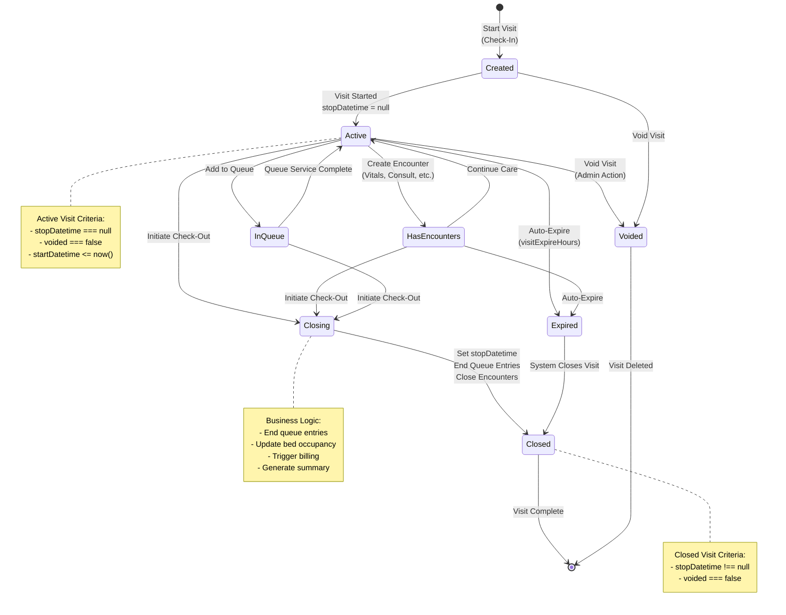
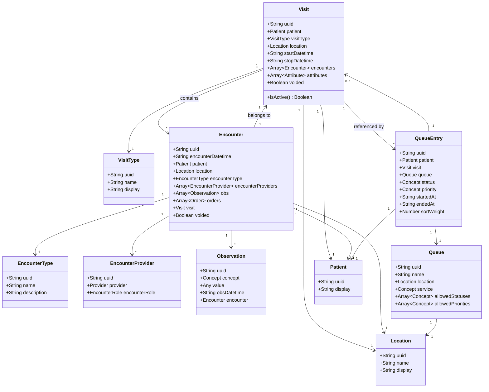
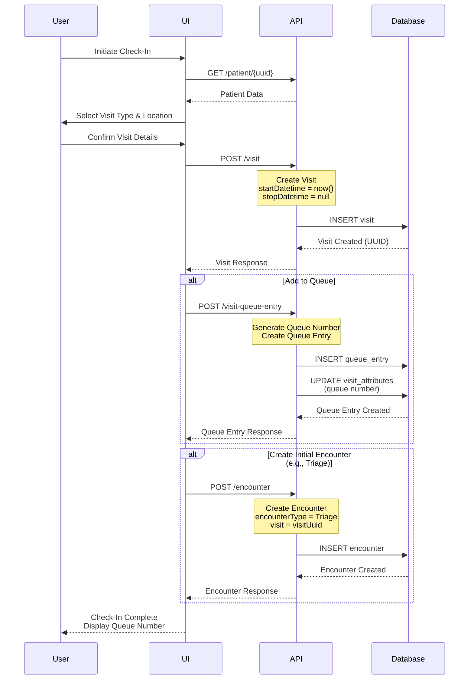
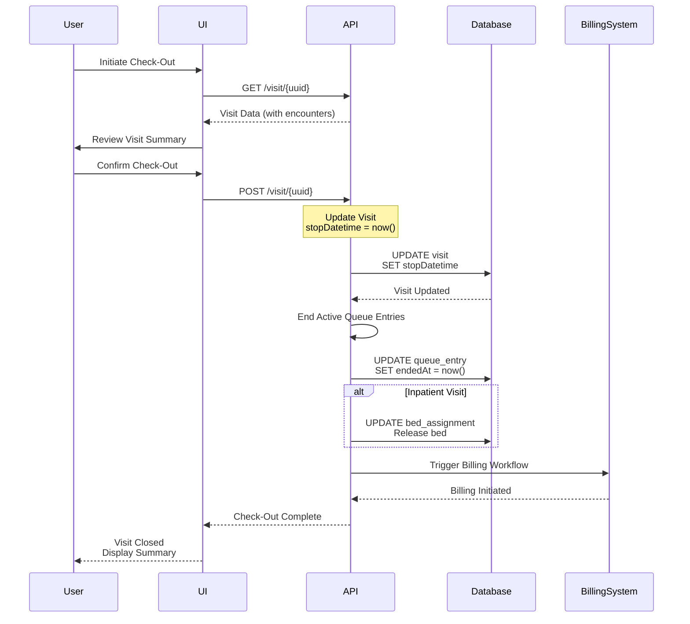

# Visit Entity Analysis

**Updated Date:** 2026-04-17  
**Analyzed By:** Technical Documentation Specialist (Paige)

---

## Table of Contents

1. [Overview](#overview)
2. [Related Files](#related-files)
3. [Data Schema](#data-schema)
4. [Business Rules](#business-rules)
5. [Legacy Constraints](#legacy-constraints)
6. [Diagrams](#diagrams)
7. [Key Insights](#key-insights)
8. [Questions & Todos](#questions--todos)

---

## Overview

This document provides a comprehensive analysis of the Visit and Encounter entities in the OpenMRS patient management system. The analysis focuses on the visit lifecycle, state transitions, encounter relationships, and the integration with queue management for patient check-in workflows.

### Purpose
- Document the complete Visit and Encounter data schemas
- Identify visit lifecycle triggers (check-in, check-out)
- Understand active vs inactive visit constraints
- Map encounter types and their mandatory data points
- Provide technical specifications for mobile app development

### Scope
This analysis covers:
- Visit core attributes (type, location, dates, status)
- Encounter structure and relationship to visits
- Visit lifecycle state transitions
- Queue entry integration with visits
- Active visit constraints and business rules

---

## Related Files

### OpenMRS Source Files Analyzed

**Type Definitions:**
- `packages/esm-service-queues-app/src/types/index.ts` - Core Visit, Encounter, and QueueEntry types
- `packages/esm-active-visits-app/src/types/index.ts` - Active visit types
- `packages/esm-ward-app/src/types/index.ts` - Ward-specific encounter types
- `e2e/commands/types/index.ts` - E2E test type definitions

**Business Logic:**
- `e2e/commands/visit-operations.ts` - Visit start and end operations
- `packages/esm-active-visits-app/src/active-visits-widget/active-visits.resource.ts` - Active visit management
- `packages/esm-service-queues-app/src/service-queues.resource.ts` - Queue entry and visit integration
- `packages/esm-ward-app/src/ward.resource.ts` - Ward admission and encounter creation

**Configuration:**
- `packages/esm-ward-app/src/hooks/useEmrConfiguration.ts` - EMR configuration including encounter types
- `packages/esm-service-queues-app/src/config-schema.ts` - Queue and visit configuration

**Mock Data:**
- `__mocks__/visits.mock.ts` - Visit mock data
- `__mocks__/encountes.mock.ts` - Encounter mock data
- `__mocks__/active-visits.mock.ts` - Active visit and queue entry mocks

---

## Data Schema

### 1. Visit Entity Structure

The Visit entity represents a patient's interaction with the healthcare facility during a specific time period.

```typescript
interface Visit {
  uuid: string;
  display: string;
  patient: {
    uuid: string;
    display: string;
  };
  visitType: {
    uuid: string;
    display: string;
  };
  indication: string | null;
  location: Location;
  startDatetime: string; // ISO 8601 format
  stopDatetime: string | null; // null = active visit
  encounters: Array<{
    uuid: string;
    display: string;
  }>;
  attributes: Array<Attribute>;
  voided: boolean;
  resourceVersion: string;
}
```

**Core Attributes:**

- **uuid**: Unique identifier for the visit
- **display**: Human-readable visit description (e.g., "Clinic or Hospital Visit @ KGH - 06/27/2024 07:40 PM")
- **patient**: Reference to the patient (UUID and display name)
- **visitType**: Type of visit (Outpatient, Inpatient, Emergency, etc.)
- **indication**: Optional reason for visit
- **location**: Facility location where visit occurs
- **startDatetime**: When the visit began (check-in time)
- **stopDatetime**: When the visit ended (check-out time) - **null indicates active visit**
- **encounters**: Array of encounters that occurred during this visit
- **attributes**: Custom visit attributes (e.g., queue number)
- **voided**: Soft delete flag
- **resourceVersion**: API version

### 2. Visit Types

Common visit types found in the system:

```typescript
interface VisitType {
  uuid: string;
  name: string;
  display: string;
}
```

**Standard Visit Types:**
- **Outpatient Visit**: Regular clinic visits
- **HIV Return Visit**: Follow-up for HIV patients
- **Diabetes Clinic Visit**: Specialized diabetes care
- **HIV Initial Visit**: First-time HIV consultation
- **Mental Health Visit**: Mental health services
- **TB Clinic Visit**: Tuberculosis treatment
- **Facility Visit**: General facility-based care
- **Home Visit**: Community/home-based care

### 3. Encounter Entity Structure

Encounters represent specific clinical interactions within a visit. A visit can have multiple encounters.

```typescript
interface Encounter {
  uuid: string;
  display: string;
  encounterDatetime: string; // ISO 8601 format
  patient: Patient;
  location: Location;
  encounterType: {
    uuid: string;
    display: string;
    name?: string;
    description?: string;
  };
  encounterProviders: Array<{
    uuid: string;
    display: string;
    encounterRole: {
      uuid: string;
      display: string;
    };
    provider: {
      uuid: string;
      person: {
        uuid: string;
        display: string;
      };
    };
  }>;
  obs: Array<Observation>;
  orders: Array<Order>;
  form?: OpenmrsResource;
  visit: Visit;
  voided: boolean;
}
```

**Core Attributes:**

- **uuid**: Unique identifier for the encounter
- **encounterDatetime**: When the encounter occurred
- **patient**: Patient reference
- **location**: Where the encounter took place
- **encounterType**: Type of clinical interaction
- **encounterProviders**: Healthcare providers involved and their roles
- **obs**: Observations/measurements recorded (vitals, diagnoses, etc.)
- **orders**: Orders placed (medications, lab tests, etc.)
- **form**: Optional form used to capture data
- **visit**: Parent visit reference
- **voided**: Soft delete flag

### 4. Encounter Types

The system supports multiple encounter types configured in the EMR:

```typescript
interface EmrApiConfigurationResponse {
  admissionEncounterType?: OpenmrsResource;
  visitNoteEncounterType?: OpenmrsResource;
  inpatientNoteEncounterType?: OpenmrsResource;
  transferRequestEncounterType?: OpenmrsResource;
  transferWithinHospitalEncounterType?: OpenmrsResource;
  exitFromInpatientEncounterType?: OpenmrsResource;
  checkInEncounterType?: OpenmrsResource;
  consultEncounterType?: OpenmrsResource;
  bedAssignmentEncounterType?: OpenmrsResource;
  cancelADTRequestEncounterType?: OpenmrsResource;
  // ... additional encounter types
}
```

**Common Encounter Types:**

1. **Check-In Encounter**: Created when patient checks in
2. **Vitals Encounter**: Recording vital signs (BP, temp, pulse, etc.)
3. **Consultation Encounter**: Doctor/clinician consultation
4. **Admission Encounter**: Inpatient admission
5. **Transfer Encounter**: Transfer between locations/wards
6. **Discharge Encounter**: Patient discharge from facility
7. **Triage Encounter**: Emergency triage assessment
8. **Lab Order Encounter**: Laboratory test orders
9. **Radiology Encounter**: Imaging orders and results
10. **Medication Encounter**: Prescription and medication orders

**Mandatory Data Points by Encounter Type:**

- **All Encounters**: encounterDatetime, patient, location, encounterType, encounterProviders
- **Vitals**: obs (blood pressure, temperature, pulse, weight, height, oxygen saturation)
- **Consultation**: obs (chief complaint, diagnosis), orders (prescriptions)
- **Admission**: obs (admission reason, bed assignment), encounterProviders (admitting physician)
- **Transfer**: obs (transfer reason, destination location)
- **Discharge**: obs (discharge disposition, discharge instructions)

### 5. Visit Attributes

Visits can have custom attributes for additional metadata:

```typescript
interface Attribute {
  attributeType: OpenmrsResource;
  display: string;
  uuid: string;
  value: string | number;
}
```

**Common Visit Attributes:**

- **Visit Queue Number**: Assigned queue number for patient tracking
  - Configured via `visitQueueNumberAttributeUuid`
  - Generated automatically when patient joins queue
  - Used for display in queue management screens

### 6. Queue Entry and Visit Relationship

Queue entries link patients to visits for workflow management:

```typescript
interface QueueEntry {
  uuid: string;
  display: string;
  patient: Patient;
  visit: Visit | null; // Visit may not exist yet
  queue: Queue;
  status: Concept; // "Waiting", "In Service", "Completed"
  priority: Concept; // "Emergency", "Urgent", "Not Urgent"
  priorityComment: string | null;
  startedAt: string; // When added to queue
  endedAt: string | null; // When removed from queue
  locationWaitingFor: Location;
  providerWaitingFor: Provider;
  sortWeight: number;
  queueComingFrom: Queue;
  previousQueueEntry: QueueEntry;
}
```

**Visit-Queue Integration:**

- Queue entry can be created **before** or **after** visit starts
- Visit is **required** for most queue operations
- Queue number is stored as visit attribute
- Multiple queue entries can reference the same visit (patient moves through queues)

### 7. Active Visit Structure

Active visits are visits where `stopDatetime` is `null`:

```typescript
interface ActiveVisit {
  id: string; // visit.uuid
  patientUuid: string;
  name: string; // patient display name
  idNumber: string | null; // patient identifier
  gender: string;
  age: string | null;
  visitType: string;
  visitUuid: string;
  visitStartTime: string; // formatted datetime
  location: string; // location UUID
  observations: Record<string, Array<{ value: any; uuid: string }>>;
  // ... additional configurable identifiers and attributes
}
```

---

## Business Rules

### 1. Visit Lifecycle Rules

**Visit Creation (Check-In):**

```typescript
// Minimum required fields to start a visit
const visitPayload = {
  patient: patientUuid,
  visitType: visitTypeUuid,
  location: locationUuid,
  startDatetime: new Date().toISOString(),
  attributes: [], // optional
};
```

**Triggers for Starting a Visit:**
1. **Manual Check-In**: User explicitly starts visit via UI
2. **Appointment Check-In**: Patient arrives for scheduled appointment
3. **Queue Entry Creation**: Adding patient to service queue
4. **Emergency Registration**: Immediate visit creation for emergencies
5. **Automatic on Encounter**: Some configurations auto-create visit when encounter is created

**Visit Closure (Check-Out):**

```typescript
// Required fields to end a visit
const endVisitPayload = {
  stopDatetime: new Date().toISOString(),
};
```

**Triggers for Ending a Visit:**
1. **Manual Check-Out**: User explicitly ends visit via UI
2. **Automatic Timeout**: Visit expires after configured hours of inactivity
3. **Discharge**: Patient discharged from facility (inpatient)
4. **Transfer**: Patient transferred to another facility
5. **Death**: Patient deceased during visit

**Business Logic Executed on Visit Closure:**
- Set `stopDatetime` to current timestamp
- End all active queue entries for this visit
- Close any open encounters (implementation-dependent)
- Trigger billing/payment workflows (if configured)
- Update bed occupancy (for inpatient visits)
- Generate visit summary report
- Archive visit data for reporting

### 2. Active Visit Constraints

**Can a Patient Have Multiple Concurrent Active Visits?**

**Answer: Generally NO, but with exceptions**

**Default Behavior:**
- System typically prevents multiple active visits for same patient
- UI shows warning if attempting to start visit when one exists
- Backend may enforce uniqueness constraint

**Exceptions:**
- **Different Locations**: Some configurations allow concurrent visits at different facilities
- **Different Visit Types**: Specialized programs may allow concurrent visits (e.g., HIV program + general clinic)
- **Configuration Override**: `allowMultipleActiveVisits` setting can enable this

**What Defines 'Active' vs 'Inactive':**

```typescript
// Active Visit
const isActive = visit.stopDatetime === null;

// Inactive Visit
const isInactive = visit.stopDatetime !== null;
```

**Database Query for Active Visits:**
```
GET /visit?includeInactive=false&location={locationUuid}
```

**Additional Active Visit Criteria:**
- `voided: false` - Not soft-deleted
- `startDatetime <= now()` - Visit has started
- `stopDatetime === null` - Visit not ended
- Optional: `location` matches current session location

### 3. Encounter Creation Rules

**Encounter-Visit Relationship:**
- Every encounter **must** belong to a visit
- Encounters cannot exist without a parent visit
- Multiple encounters can belong to same visit
- Encounters inherit visit's location (can be overridden)

**Encounter Creation Workflow:**

```typescript
const createEncounter = async (
  patient: Patient,
  encounterType: string,
  visitUuid: string,
  obs: Array<Observation> = [],
) => {
  const encounterPayload = {
    patient: patient.uuid,
    encounterType: encounterType,
    visit: visitUuid,
    location: currentLocation.uuid,
    encounterDatetime: new Date().toISOString(),
    encounterProviders: [
      {
        provider: currentProvider.uuid,
        encounterRole: defaultEncounterRole.uuid,
      },
    ],
    obs: obs,
  };
  
  return await openmrsFetch(`${restBaseUrl}/encounter`, {
    method: 'POST',
    body: JSON.stringify(encounterPayload),
  });
};
```

**Validation Rules:**
- `patient` is required
- `encounterType` is required
- `visit` is required
- `location` is required
- `encounterDatetime` is required
- `encounterProviders` must have at least one provider
- `encounterDatetime` must be within visit date range
- `encounterDatetime` cannot be in the future

### 4. Queue Entry and Visit Rules

**Queue Entry Creation:**

```typescript
const addPatientToQueue = async (
  patientUuid: string,
  visitUuid: string,
  queueUuid: string,
  priorityUuid: string,
  statusUuid: string,
  locationUuid: string,
) => {
  // Generate queue number as visit attribute
  await generateVisitQueueNumber(
    locationUuid,
    visitUuid,
    queueUuid,
    visitQueueNumberAttributeUuid,
  );
  
  // Create queue entry
  const queueEntryPayload = {
    visit: { uuid: visitUuid },
    queueEntry: {
      patient: { uuid: patientUuid },
      queue: { uuid: queueUuid },
      status: { uuid: statusUuid },
      priority: { uuid: priorityUuid },
      startedAt: new Date(),
      sortWeight: 0,
    },
  };
  
  return await openmrsFetch(`${restBaseUrl}/visit-queue-entry`, {
    method: 'POST',
    body: JSON.stringify(queueEntryPayload),
  });
};
```

**Queue Status Transitions:**
- **Waiting** → **In Service**: Provider calls patient
- **In Service** → **Completed**: Service finished
- **Waiting** → **Cancelled**: Patient left or no-show
- **Any** → **Waiting**: Re-queue patient

**Queue and Visit Lifecycle:**
- Queue entry can outlive visit (if visit closed while in queue)
- Ending visit should end associated queue entries
- Queue entry `endedAt` timestamp marks completion

---

## Legacy Constraints

### 1. Visit Expiration

**Automatic Visit Closure:**
- Configuration: `visitExpireHours` (default: 12-24 hours)
- Background job checks for visits exceeding expiration time
- Automatically sets `stopDatetime` if no recent activity
- Prevents indefinitely open visits

**Implications:**
- Mobile apps must handle expired visits gracefully
- Re-opening expired visit may create new visit instead
- Offline sync must account for server-side expiration

### 2. Voided Visits

**Soft Delete Behavior:**
- Visits are never hard-deleted, only voided
- `voided: true` flag marks deleted visits
- Voided visits excluded from active visit queries
- Voided visits retained for audit trail

**Voiding Rules:**
- Only visits with no encounters can be voided (implementation-dependent)
- Voiding visit may void associated encounters
- Voided visits cannot be un-voided via standard UI

### 3. Visit Type Constraints

**Visit Type Selection:**
- Visit type is **required** at visit creation
- Visit type **cannot be changed** after creation
- Different visit types may have different workflows
- Visit type determines available encounter types

### 4. Location Constraints

**Visit Location Rules:**
- Visit location is **required** at creation
- Visit location typically matches session location
- Encounters within visit can have different locations
- Location hierarchy affects visit visibility

**Location-Based Filtering:**
```typescript
// Query includes parent locations
GET /visit?location={locationUuid}&includeParentLocations=true
```

### 5. Encounter Ordering

**Encounter Sequence:**
- Encounters ordered by `encounterDatetime`
- First encounter often determines visit workflow
- Specific encounter types must occur in order (e.g., Admission before Discharge)
- No system-enforced ordering, relies on business logic

### 6. Offline Synchronization

**Offline Visit Creation:**
- Visits created offline queued for sync
- UUID generated client-side
- Conflict resolution if visit already exists
- Encounters linked to offline visit UUID

**Sync Challenges:**
- Visit expiration during offline period
- Duplicate visits if sync fails
- Queue number conflicts
- Encounter datetime conflicts

---

## Diagrams

### Visit Lifecycle State Diagram



### Visit and Encounter Relationship Diagram



### Check-In Workflow Sequence Diagram



### Check-Out Workflow Sequence Diagram



---

## Key Insights

### 💡 Business Insights

- **Visit as Container**: The Visit entity acts as a container for all clinical interactions during a patient's time at the facility. This design allows for comprehensive tracking of care episodes.

- **Flexible Encounter Model**: Multiple encounters within a single visit enable detailed tracking of different clinical activities (vitals, consultation, procedures) while maintaining the overall visit context.

- **Queue Integration**: The tight integration between visits and queue management enables efficient patient flow tracking. Queue numbers stored as visit attributes provide a unified patient tracking mechanism.

- **Active Visit Determination**: The simple rule (`stopDatetime === null`) for determining active visits makes queries efficient and the concept easy to understand across the system.

- **Visit Type Immutability**: Once set, visit types cannot be changed, ensuring consistent workflow and reporting. This prevents confusion about what type of care was provided.

- **Location-Based Filtering**: Visit queries respect location hierarchy, allowing facilities to see visits at their location and child locations, supporting multi-site deployments.

- **Encounter Provider Tracking**: Every encounter tracks which providers were involved and their roles, supporting accountability and billing requirements.

### ⚠️ Risks & Warnings

- **No Concurrent Visit Prevention**: While generally discouraged, the system doesn't strictly prevent multiple active visits for the same patient. This could lead to:
  - Duplicate data entry
  - Confusion about which visit to use
  - Billing complications
  - **Mitigation**: Implement UI warnings and backend validation

- **Visit Expiration Edge Cases**: Automatic visit expiration can cause issues:
  - Long procedures may exceed expiration time
  - Offline mobile apps may not know visit expired
  - Encounters created after expiration may fail
  - **Mitigation**: Configure appropriate expiration times; implement grace periods

- **Encounter-Visit Date Validation**: The system should validate that encounter dates fall within visit dates, but this may not be strictly enforced:
  - Encounters could be backdated outside visit window
  - Clock skew in distributed systems
  - **Mitigation**: Implement strict validation; handle clock synchronization

- **Queue Entry Orphaning**: If a visit is closed while patient is in queue:
  - Queue entry may reference closed visit
  - Patient appears in queue but visit is inactive
  - **Mitigation**: Automatically end queue entries when closing visit

- **Voiding Complexity**: Voiding visits with encounters is complex:
  - Should encounters be voided too?
  - What about observations and orders?
  - Billing implications
  - **Mitigation**: Clear business rules; prevent voiding visits with clinical data

- **Offline Sync Conflicts**: Mobile apps creating visits offline face challenges:
  - Visit may expire before sync
  - Duplicate visits if sync retries
  - Queue number conflicts
  - Encounter datetime conflicts
  - **Mitigation**: Robust conflict resolution; client-side validation

- **Missing Check-Out**: Visits may remain open indefinitely if:
  - User forgets to check out patient
  - System crash during visit
  - Patient leaves without formal check-out
  - **Mitigation**: Automatic expiration; periodic cleanup jobs; UI reminders

### 💡 Mobile Optimization Opportunities

1. **Streamlined Check-In Flow**:
   - Pre-populate visit type based on appointment
   - Auto-select location from device/session
   - One-tap check-in for scheduled appointments
   - Offline queue number generation

2. **Smart Visit Detection**:
   - Automatically detect active visit when opening patient chart
   - Prompt to close old visits before starting new one
   - Show visit duration and expiration countdown

3. **Encounter Templates**:
   - Pre-configured encounter types for common workflows
   - Quick-entry forms for vitals and triage
   - Voice-to-text for observations

4. **Queue Status Visibility**:
   - Real-time queue position updates
   - Estimated wait time calculations
   - Push notifications when patient called

5. **Offline Resilience**:
   - Local visit creation with sync queue
   - Conflict detection and resolution UI
   - Graceful handling of expired visits
   - Background sync of encounters

6. **Visit Summary**:
   - Auto-generated visit summary at check-out
   - Printable/shareable visit report
   - Next appointment scheduling integration

---

## Questions & Todos

### Open Questions

1. **Q: What happens to encounters if a visit is voided?**
   - Need to verify cascade behavior
   - Check if encounters are automatically voided
   - Understand implications for billing and reporting

2. **Q: Can visit type be changed after creation?**
   - Current analysis suggests no
   - Need to confirm if admin override exists
   - Understand impact on reporting if allowed

3. **Q: How are concurrent visits at different locations handled?**
   - Configuration option exists but behavior unclear
   - Need to test multi-location scenarios
   - Understand reporting implications

4. **Q: What is the maximum number of encounters per visit?**
   - No apparent limit in code
   - Performance implications for large visits
   - Best practices for long-term inpatient stays

5. **Q: How does visit expiration interact with offline mobile apps?**
   - Need to test offline scenarios
   - Understand sync conflict resolution
   - Document best practices for mobile developers

### Todo Items

- [ ] Document specific encounter type configurations for target deployment
- [ ] Create API examples for common visit operations
- [ ] Map visit lifecycle to mobile app screens
- [ ] Document offline sync conflict resolution strategies
- [ ] Create test scenarios for edge cases (concurrent visits, expiration, voiding)
- [ ] Document billing integration points
- [ ] Create performance benchmarks for visits with many encounters
- [ ] Document security/permissions model for visit operations
- [ ] Map visit attributes used in production deployments
- [ ] Create troubleshooting guide for common visit issues

### Next Analysis Steps

1. **Observation Entity Analysis**: Deep dive into obs structure and concept dictionary
2. **Order Entity Analysis**: Medication orders, lab orders, and order workflows
3. **Queue Management Analysis**: Complete queue lifecycle and service workflows
4. **Billing Integration Analysis**: How visits trigger billing and payment workflows
5. **Reporting Analysis**: How visits and encounters feed into reports and dashboards

---

**Document Status**: ✅ Complete - Ready for Review  
**Last Updated**: 2026-04-17  
**Next Review**: When implementing mobile check-in/check-out workflows
